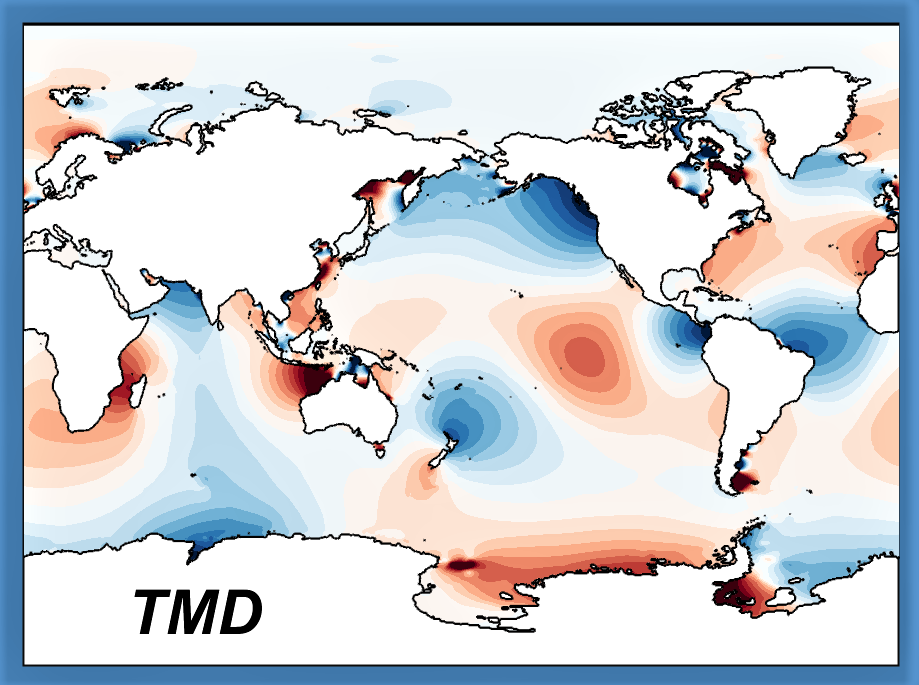

# TMD_Matlab_Toolbox_v2.5

<table class=MsoTableGrid border=0 cellspacing=0 cellpadding=0
 style='border-collapse:collapse;border:none'>
 <tr>
  <td width=312 valign=top style='width:233.75pt;padding:0in 5.4pt 0in 5.4pt'>
  
&nbsp;

  
Susan Howard, ESR

  
Laurie Padman, ESR

  
Lana Erofeeva, OSU

  
&nbsp;

  </td>
  <td width=400 valign=top style='width:233.75pt;padding:0in 5.4pt 0in 5.4pt'>
  
<a
  href="tide_elev_map_global_sm.jpg"
  target="_blank"></a>

  </td>
 </tr>
</table>

&nbsp;

<a href="http://www.esr.org/">ESR</a>&nbsp;and&nbsp;<a href="http://volkov.oce.orst.edu/tides/">Oregon
State University (OSU)</a>&nbsp;create and serve global
and regional barotropic tide models (where currents are depth-averaged). 

The Tide Model Driver (TMD) toolbox runs in a user’s current Matlab
installation. TMD allows a user to access specific tide models, output harmonic
constants (amplitudes and phase for sea surface height and current components;
and tidal current ellipse properties), and to make tidal predictions. 

TMD 2.5 includes two components: (1) a set of scripts for accessing tidal fields and making predictions; and (2) a graphical user interface (GUI) for quickly browsing tide fields, zooming in on regions of interest, and selecting points and time ranges for predictions of specific variables.

TMD works with:
<ul>
 <li> Arctic and Antarctic models available from ESR’s web page (https://www.esr.org/research/polar-tide-models/)
  <li>Global and regional models provided by OSU (https://www.tpxo.net) in binary format with all constituents in a single file. 
</ul>

&nbsp;

<i><b>Alternatives to the MATLAB TMD toolbox:</b></i>

<b>FORTRAN:</b> A Fortran version of this package is made available through OSU: <a href="https://www.tpxo.net/otps">OSU Tidal Prediction software (OTPS)</a> 

<b>PYTHON:</b> <a href="https://github.com/tsutterley/pyTMD"> pyTMD</a>, created by T. C. Sutterley, is a Python-based tidal prediction software package, based on our MATLAB TMD package, that reads OTIS and GOT formatted tidal solutions for calculating ocean and load tides.

&nbsp;

