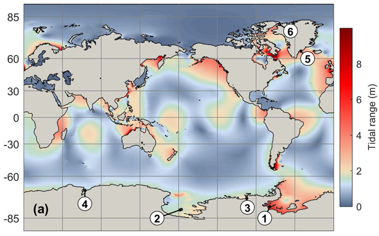

# TMD_Matlab_Toolbox_v2.5

<table class=MsoTableGrid border=0 cellspacing=0 cellpadding=0
 style='border-collapse:collapse;border:none'>
 <tr>
  <td width=312 valign=top style='width:233.75pt;padding:0in 5.4pt 0in 5.4pt'>
  
&nbsp;

  
Susan Howard, ESR

  
Laurie Padman, ESR

  
Lana Erofeeva, OSU

  
&nbsp;

  </td>
  <td width=312 valign=top style='width:233.75pt;padding:0in 5.4pt 0in 5.4pt'>
  
<a
  href="tide_elev_map_global_sm.jpg"
  target="_blank"></a>

  </td>
 </tr>
</table>

&nbsp;

<a href="http://www.esr.org/">ESR</a>&nbsp;and&nbsp;<a href="http://volkov.oce.orst.edu/tides/">Oregon
State University (OSU)</a>&nbsp;create and serve global
and regional barotropic tide models (where currents are depth-averaged). 

The Tide Model Driver (TMD) toolbox runs in a user’s current Matlab
installation. TMD allows a user to access specific tide models, output harmonic
constants (amplitudes and phase for sea surface height and current components;
and tidal current ellipse properties), and to make tidal predictions. 

The TMD package consists of low-level scripts. The model grid
files that can be used with  TMDversion 2.5 and earlier are formatted to match
the&nbsp;<a
href="http://volkov.oce.orst.edu/tides/otis.html">Oregon State Tidal Inversion
Software (OTIS)&nbsp;</a>binary format for model
bathymetry, sea surface height, and depth-integrated volume transport files. 
These model files  are also compatible with the OSU&nbsp;<a href="http://volkov.oce.orst.edu/tides/otps.html">Tidal
Prediction Software (OTPS) FORTRAN code</a><u>.</u>

Tide
models that are compatible with TMD can be found on <a href="https://www.tpxo.net/home">OSU’s tide model website</a> and
ESR’s&nbsp;<a
href="https://www.esr.org/research/polar-tide-models/">Polar Tide Model
website&nbsp;</a>.

&nbsp;

